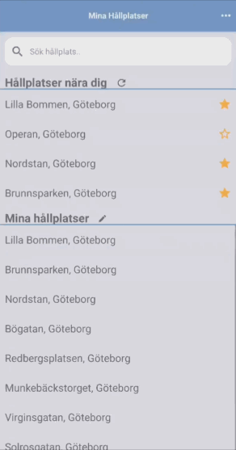

# Mina Hållplatser

This started out as a small school project for a frontend course.
Now it is a project I am working with on my spare time.

## What is this?

It is a mobile app used to check departures from the local public transit company (Västtrafik).

## Technologies used

React Native, Redux, React Navigation and react-native-vector-icons.
The project also uses Firebase to track usage.
For tracking user behavior it uses Firebase Analytics.

## Backend service

The app has used multiple backends because I like to learn new things. (including js/node, c#/dotnetcore2 & python3)
Currently no backend is being used.

## Download from Google Play

https://play.google.com/store/apps/details?id=com.oakis.minahallplatser

## Next steps

* Write tests with Jest
* Create logo, icon and other graphics
* Release version 1.0 on Google Play
* Release app for iOS
